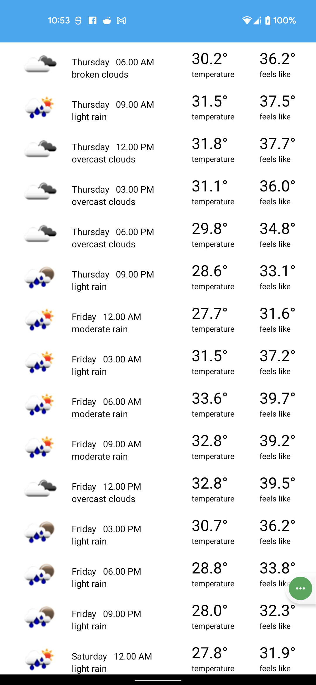
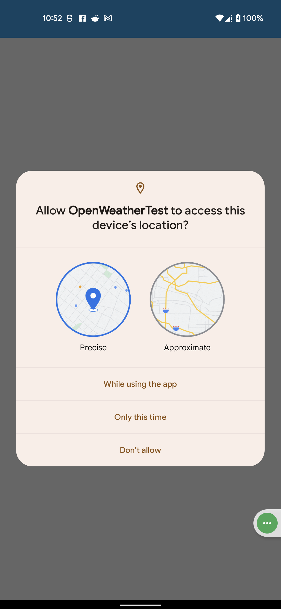

# openweathertest
##### App UI Screens
 &emsp; &emsp; 

#### I completed this project using MVVM (Model View Viewmodel) architechture. 
## Tasks I have completed so far: 
- Fetch location & openweather data based on the location periodically in an interval of 12 hours 
- Show the weather data in an android recycleview 
- Programmed a notification system for users to notify user before 5 minutes if any prababilities of rain 
### Tools & libraries used in this project: 
- Retrofit
- Workmanager
- Room 
- Databinding 
- Glide

#### Note: Additionally I handled some extra tasks such as network accessibility check & render proper UI state based on it, Api unit testing & response handling.
